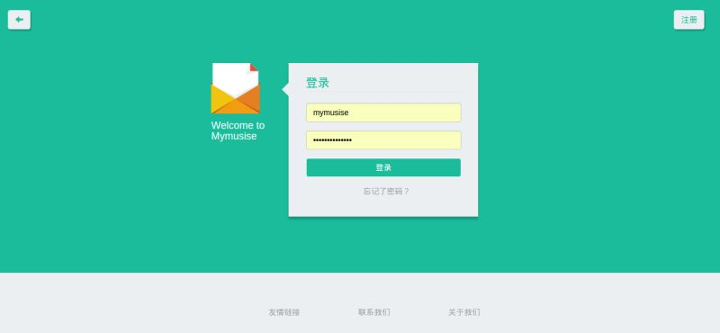
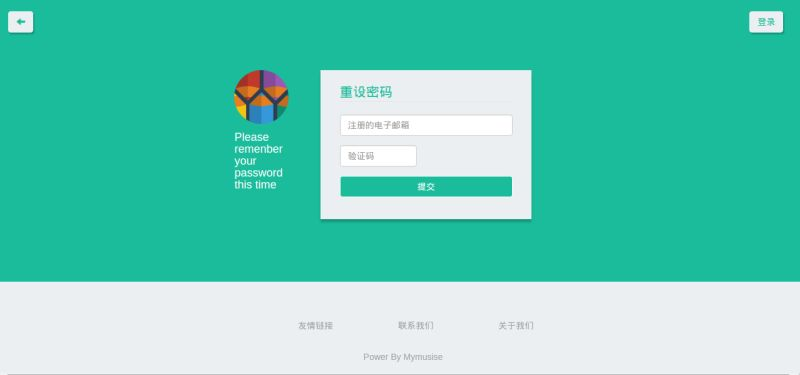

Django-CMS-Bootstrap
====

This should be a cms system with django , but Not finish yet .The UI design was reference **Flat UI**.

#Screenshot

#Environment
- Django >= 1.8

#Version 0.X

- Support regist by email
- Support sign-in sign-up
- Support reset password

#Hope guys like it~

